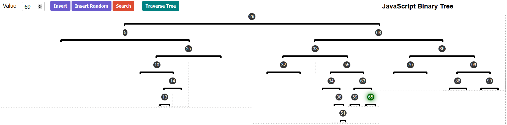

# Binary Tree

> <a href="https://lufemas.github.io/binary-tree-jr/">Run the App</a>

##   A pure JavaScript binary tree implementation. 

### `BNode.js` and `BTree.js`
-   With these two classes you have a Binary Tree implementation without a graphic representation on the Browser.
-   The `BTree` class is just for the sage root creation, the `BNode` class has all the needed logic.

### `NodeDOM.js` and `TreeDOM.js`
-   With these two classes you have a Binary Tree implementation that renders a graphical feedback to the Browser.

Every action you run on the Broswer is also being done to the `console` Binary Tree version. You can see all the feedback trough the Broswer `console`.
